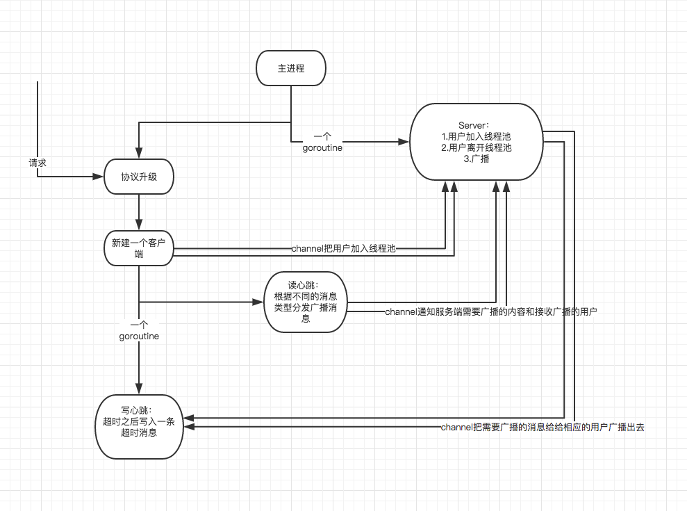

# TooWhite
一个websocket消息分组和个人的广播系统，使用mongodb作为后端数据库服务支持

## 系统整体流程图



## 安装

本系统使用mongodb作为数据库服务，需要[安装mongodb](http://www.runoob.com/mongodb/mongodb-window-install.html)

```ssh
$ git clone https://github.com/RT7oney/TooWhite.git
$ go get labix.org/v2/mgo
$ go get github.com/gorilla/websocket
```

代码部署完成之后进入代码目录，在conf/目录下进行配置mongodb的具体参数

```ssh
$ cd TooWhite
$ go run *.go
```

## 接口调用

### url:
ws://xx.xxx.xx.xx:12345

###  请求格式
    json

###  请求参数
| 字段                     |   必选            |   类型及范围    | 说明                               |
|:-------------------------|:----------------- |:----------------|:-----------------------------------|
|msgtype|true|int|消息类型|
|from|true|string|消息发起人的唯一标识ID|
|target|true|string|消息接受者（个人/群组）的唯一标识ID|
|data|true|string|字符串化的数据（可根据之后的需求自由定制）|


###  请求示例
```javascript
so = new WebSocket(url);
so.send('{"MsgType":0,"From":"XXXXX","Target":"XXXX","Data":"XXXX"}');
```

###  请求类型
##### 用户加入
* msgtype 值为 0
* from 传入用户在系统中的唯一标识ID
* target null
* data 传入用户的昵称

##### 增加一个新的分组
* msgtype 值为 1
* from 传入用户在系统中的唯一标识ID
* target null 
* data 分组的名称

##### 用户加入一个分组
* msgtype 值为2
* from 传入用户在系统中的唯一标识ID
* target null
* data 需要加入的分组的名称

##### 点对点消息
* msgtype 值为3
* from 传入用户在系统中的唯一标识ID
* target 传入用户在系统中的唯一标识ID
* data 消息内容

##### 群组消息
* msgtype 值为4
* from 传入用户在系统中的唯一标识ID
* target 传入分组在系统中的唯一标识ID
* data 消息内容

##### 删除分组
* msgtype 值为5
* from 传入用户在系统中的唯一标识ID
* target null
* data 需要删除的分组的名称（需要该用户为分组的创建人）

##### 用户离开分组
* msgtype 值为6
* from 传入用户在系统中的唯一标识ID
* target null
* data 需要离开的分组的名称

## 示例

```html
<!DOCTYPE html>
<html>

<head>
    <meta charset="UTF-8">
    <title>
        test websocket
    </title>
</head>
<style type="text/css">
div {
    width: 100%;
    height: 100px;
    text-align: center;
    padding-top: 20px;
    border: 1px solid black;
}
</style>

<body>
    <div>
        <input id="msg" type="text" name="" placeholder="消息">
        <br> 发送至
        <input id="to" type="text" name="" placeholder="目标">
        <br>
        <button onclick="sendMessageToUser()">私信</button>
        <button onclick="sendMessageToGroup()">群聊</button>
    </div>
    <div>
        <input id="add-group" type="text">
        <button onclick="addGroup()">增加分组</button>
    </div>
    <div>
        <input id="user-join-group" type="text">
        <button onclick="userJoinGroup()">用户加入分组</button>
    </div>
    <footer>
        &copy;TooWhite
    </footer>
</body>
<script type="text/javascript">
if (typeof(WebSocket) == 'undefined') {
    alert('你的浏览器不支持 WebSocket ，推荐使用Google Chrome 或者 Mozilla Firefox');
}
var user_id = prompt("用户唯一TOKEN", "");
if (user_id == "") {
    user_id = "user" + Date.parse(new Date());
}
var user_name = prompt("用户名", "all");;
var uri = 'ws://10.65.106.96:1234';
createSocket(uri);
/**
 * socket建立
 */
function createSocket(uri) {
    so = new WebSocket(uri);
    console.log(so);
    so.onopen = function() {
        if (so.readyState == 1) {
            console.log('===user register===', user_id);
            so.send('{"MsgType":0,"From":"' + user_id + '","Target":"","Data":"' + user_name + '"}');
        }
    }
    so.onclose = function() {
        so = false;
    }
    so.onmessage = function(recv_msg) {
        console.log('===recv_msg===', recv_msg);
        // console.log('recv_msg.type------' + recv_msg.type);
    }
}
/**
 * 发送消息给用户
 */
function sendMessageToUser() {
    var to_user = document.getElementById('to').value;
    var content = document.getElementById('msg').value;
    so.send('{"MsgType":3,"From":"' + user_id + '","Target":"' + to_user + '","Data":"' + content + '"}');
    return false;
}
/**
 * 发送消息给分组
 */
function sendMessageToGroup() {
    var to_group = document.getElementById('to').value;
    var content = document.getElementById('msg').value;
    so.send('{"MsgType":4,"From":"' + user_id + '","Target":"' + to_group + '","Data":"' + content + '"}');
    return false;
}
/**
 * 增加分组
 */
function addGroup() {
    var group = document.getElementById('add-group').value;
    so.send('{"MsgType":1,"From":"' + user_id + '","Target":"","Data":"' + group + '"}')
    return false;
}
/**
 * 用户加入分组
 */
function userJoinGroup() {
    var group = document.getElementById('user-join-group').value;
    so.send('{"MsgType":2,"From":"' + user_id + '","Target":"","Data":"' + group + '"}')
    return false;
}
</script>
</html>
```
